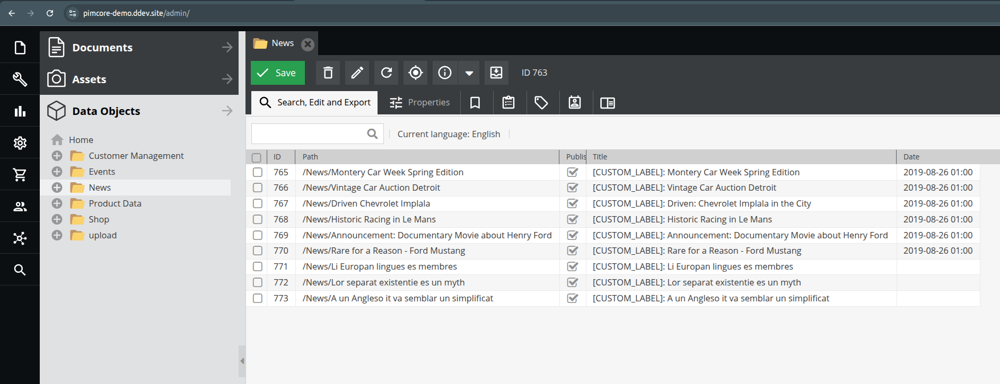
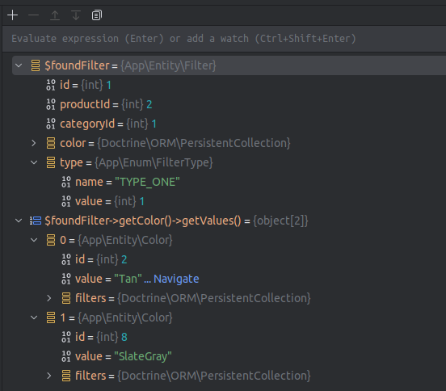
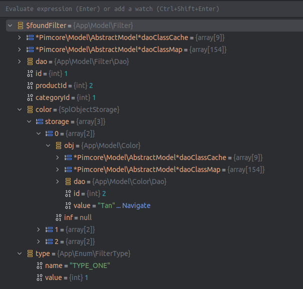
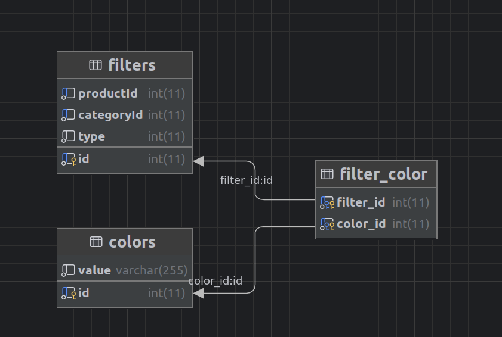

## Tasks Explanation

### Task 1
_Override some existing method for any pimcore model with additional logic._

&nbsp;

__Solution__:

For this we can simply declare our class in `config/config.yaml`, see my example in [config/config.yaml](config/config.yaml) (pimcore > models).

The customization I added is in [src/Model/DataObject/News.php](src/Model/DataObject/News.php), it adds a `[CUSTOM_LABEL]:` text before every `News` object title, see screenshot:



&nbsp;

### Task 2
_Create custom model (not pimcore class, DAO approach) to be able to work with table Filters._

_Table Filters structure:_
- _productId_
- _categoryId_
- _color (may have many items)_
- _type (1, 2, 3)_

_add any other fields or tables if needed_

&nbsp;

__Solutions__:

According to the [Custom Persistent Models](https://docs.pimcore.com/platform/Pimcore/Extending_Pimcore/Custom_Persistent_Models/) docs this can be done at least in 2 ways:
1. Use Doctrine ORM
2. Working with Pimcore Data Access Objects (Dao)

I implemented both, Doctrine helped me to generate the entity class via `symfony/maker-bundle` and create the database migration for required tables.
See [src/Entity/Filter.php](src/Entity/Filter.php), [src/Entity/Color.php](src/Entity/Color.php) and [src/Migrations/Version20250824104524.php](src/Migrations/Version20250824104524.php).

PHP object example:



After that I created a DAO models for working with data in more Pimcore way with the __same database schema__, see [src/Model/Filter.php](src/Model/Filter.php), [src/Model/Color.php](src/Model/Color.php) and [src/Model/Filter/Dao.php](src/Model/Filter/Dao.php), filter Dao model is also responsible for storing color relations, see `private` methods in [src/Model/Filter/Dao.php](src/Model/Filter/Dao.php). As far as colors are also models I use a `SplObjectStorage` for storing them in the filter model property.

PHP object example:



&nbsp;

Demo cases with models usage is added to [src/Model/DataObject/News.php](src/Model/DataObject/News.php)

&nbsp;

Database notes:
- I used many-to-many relation between filters and colors, here is the schema:

- for `type` column I used a PHP `enum` custom type that is used by Doctrine, see [src/Enum/FilterType.php](src/Enum/FilterType.php), I made a DAO model also to use it like this type. In the database it is stored as integer but we can also use a MySQL ENUM data type here.
- potentially entity tables can contain extra fields like `created_at`, `updated_at` but I skip this part for simplicity.

&nbsp;

### Task 3
_Create implementation for override some existing symfony service (pseudo code)_

&nbsp;

__Solutions__:
1. For small customizations we can decorate the main service in the `config/services.yaml`, Pimcore vendor example:
```yaml
    # Decorates Symfony Mailer
    Pimcore\Mail\Mailer:
        decorates: mailer
        arguments:
            - '@Pimcore\Mail\Mailer.inner'
            - '@Pimcore\Mail\Plugins\RedirectingPlugin'
        public: true
```

2. The next approach is to replace the service completely with `class` property in `config/services.yaml`, Pimcore example:
```yaml
    # ---------------------------------------------------------
    # Overwrite Pimcore Default Services
    # ---------------------------------------------------------

    # overwrite PimcoreUrl helper to add existing parameters to generated urls
    Pimcore\Twig\Extension\Templating\PimcoreUrl:
        class: App\Website\Tool\PimcoreUrl
        arguments:
            $generator: '@router'
```

3. For complex conditional overrides [compiler passes](https://symfony.com/doc/current/service_container/compiler_passes.html) are used:
   - by implementing `process` method from `Symfony\Component\DependencyInjection\Compiler\CompilerPassInterface` interface
   - or by creating custom passes and adding them to `build` method of the application kernel.